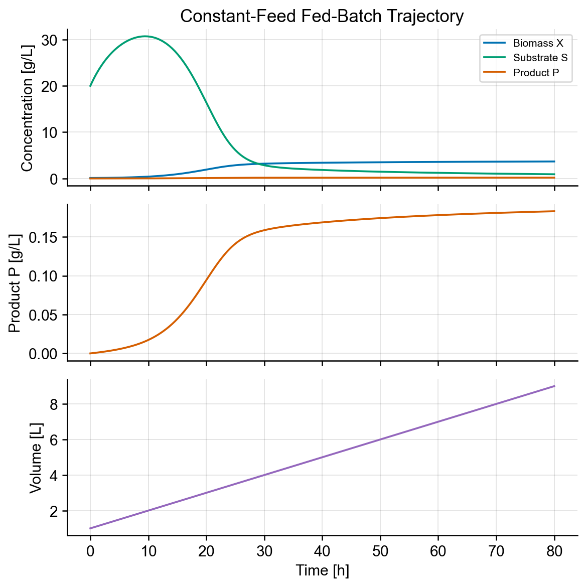
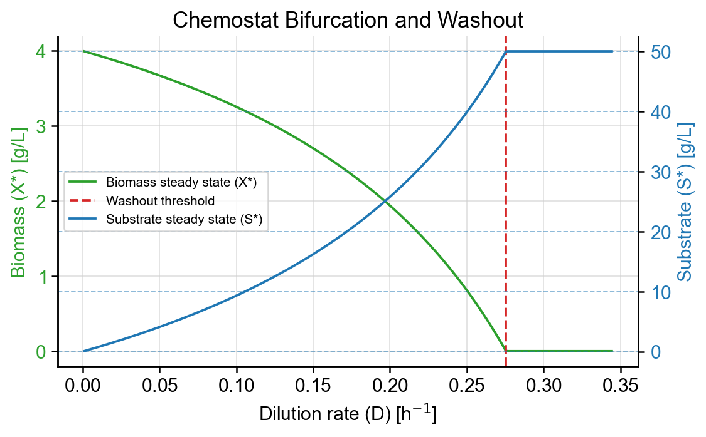
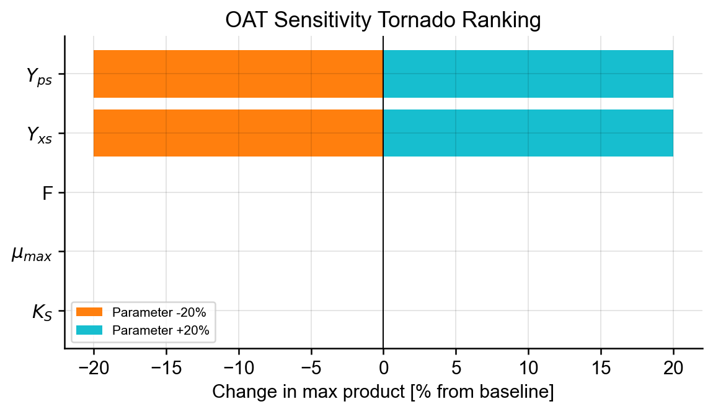

# Bioreactor Digital Twin

[](https://molab.marimo.io/github/seanhu0401/bioreactor-digital-twin/blob/main/notebooks/bioreactor_digital_twin.py)

This repository contains a small mechanistic bioreactor simulation package for the Bioreactor Digital Twin project. The current code supports batch, constant-feed fed-batch, exponential fed-batch, and chemostat modes with tested mass-balance, quasi-steady-state substrate, washout-threshold, one-at-a-time sensitivity, and tornado-ranking checks.

## Layout

- `bioreactor/` - model package.
- `bioreactor/params.py` - frozen `BioreactorParams` defaults and units.
- `bioreactor/state.py` - initial state construction and initial-volume validation.
- `bioreactor/kinetics.py` - Monod growth and growth-coupled product-rate helpers.
- `bioreactor/feeds.py` - batch, constant fed-batch, exponential fed-batch, and chemostat feed modes.
- `bioreactor/models.py` - ODE right-hand side for state vector `[X, S, P, V]`.
- `bioreactor/simulate.py` - `solve_ivp` wrapper returning `SimulationResult`.
- `bioreactor/steady_state.py` - chemostat steady-state and washout analysis.
- `bioreactor/sensitivity.py` - deterministic one-at-a-time sensitivity analysis and tornado ranking.
- `bioreactor/validation.py` - reusable mass-balance, quasi-steady-state (QSS), and steady-state error checks.
- `notebooks/` - Marimo notebook location.
- `notebooks/bioreactor_digital_twin.py` - static Marimo notebook for reproducibility and curated project figures. 
- `figures/` - exported notebook figures for README and publication use.
- `tests/` - tests for model, feed modes, and sensitivity.

## Model setup

The dynamic state is ordered as:

- `X` - biomass concentration `[g/L]`
- `S` - substrate concentration `[g/L]`
- `P` - product concentration `[g/L]`
- `V` - reactor volume `[L]`

Use `initial_state(...)` to build a consistent state vector from biological initial conditions while taking `V_0` from `BioreactorParams`:

```python
from bioreactor.params import BioreactorParams
from bioreactor.simulate import simulate
from bioreactor.state import initial_state

params = BioreactorParams(F=0.1, V_max=30.0)
y0 = initial_state(X0=0.1, S0=20.0, P0=0.0, params=params)

result = simulate(
    "fedbatch_const",
    params,
    y0,
    (0.0, 80.0),
    rtol=1e-9,
    atol=1e-11,
)
```

`simulate(...)` validates that `y0[3]` matches `params.V_0` before solving. Chemostat simulations attach `result.chemostat`, a `ChemostatAnalysis` object with the dilution rate, washout threshold, expected washout flag, and analytical steady state.

## Solver and tolerances

`simulate(...)` uses SciPy's `LSODA` method. This is a practical default for this project because the same model can move between non-stiff and mildly stiff behavior across feed strategies, substrate depletion, washout, and parameter sweeps. `LSODA` switches between non-stiff and stiff integration internally, which keeps the package usable before choosing a solver per experiment. It currently does not support changing the solver method but it will be added in the future.

The examples and validation tests use tighter tolerances (`rtol=1e-9`, `atol=1e-11`) than typical exploratory notebook runs. Those settings are meant to check analytical mass balances and steady states, not to claim that every exploratory run needs that precision.

## Reproducible notebook and figures

The shipped marimo notebook is `notebooks/bioreactor_digital_twin.py`. Run it from this directory to execute the figure workflow:

```bash
uv run python notebooks/bioreactor_digital_twin.py
```

The README uses three checked-in curated outputs:

- Fed-batch trajectory: `figures/fedbatch_trajectory.png`
- Chemostat washout/bifurcation: `figures/chemostat_bifurcation.png`
- One-at-a-time sensitivity tornado ranking: `figures/oat_sensitivity_tornado.png`



*Figure 1. Constant-feed fed-batch trajectory for biomass, substrate, product, and reactor volume.*

---



*Figure 2. Chemostat washout boundary showing dilution-rate effects on biomass and substrate steady states.*

---



*Figure 3. One-at-a-time sensitivity tornado ranking for maximum product concentration.*

By default, the notebook does not overwrite these images. To regenerate the PNG files, set `SAVE_FIGURES = True` in the notebook setup cell and rerun the command above.

## Model assumptions

- Monod substrate-limited growth: `mu(S) = mu_max S / (K_S + S)`.
- State vector uses concentrations for `X`, `S`, and `P`, plus reactor volume `V`.
- Product formation is modeled as growth-coupled through `Y_ps * mu(S)`.
- Death/maintenance is available through `k_d` but defaults to zero.
- Fed-batch feed is smoothly reduced near `V_max` to avoid a discontinuous RHS.
- Analytical fed-batch mass-balance and QSS substrate checks assume the volume cap is not engaged.
- The feed for both fed-batch constant and exponential are clamped using as the reactor volume approaches `V_max`.
- Chemostat washout analysis uses the feed substrate concentration through `mu(S_f) - k_d`.

## Limitations

- Parameters are illustrative defaults, not fitted to empirical bioreactor data.
- No empirical calibration or parameter-estimation workflow is included yet.
- Maintenance/death effects are off by default through `k_d = 0.0`.
- Oxygen transfer, pH, temperature, inhibition, substrate toxicity, and product toxicity are not modeled.
- Feed profiles are prescribed modes, not optimized control policies.
- Product formation is simplified as growth-coupled through `Y_ps * mu(S)`.
- The smooth volume-cap feed reduction changes the analytical fed-batch assumptions once the cap is approached.
- Solver choice and tolerances should be revisited for new parameter regimes, especially deliberately stiff cases.

## Future development

- Add an interactive companion notebook with controls for exploratory parameter and feed-mode studies.
- Add calibration or parameter-estimation workflows when empirical data is available.
- Add richer biology such as maintenance, death, inhibition, oxygen limitation, or product toxicity.
- Explore feed optimization or control-oriented simulations.

## Development

Install dependencies and run the test suite from this directory:

```bash
uv sync
uv run pytest
uv run pytest --cov=bioreactor --cov-report=term-missing
uv run python notebooks/bioreactor_digital_twin.py
uv run marimo edit notebooks/bioreactor_digital_twin.py
```

The current test suite covers feed modes, constant-feed fed-batch mass balance, quasi-steady-state substrate tracking, chemostat steady-state convergence, chemostat washout/bifurcation behavior, sensitivity input validation, and tornado ranking.
